# DeliveryApp

A Flutter-based delivery application showcasing a complete shopping experience with product browsing, cart management, and checkout functionality.

## 📱 Screenshots

### Home Screen & Product Listing
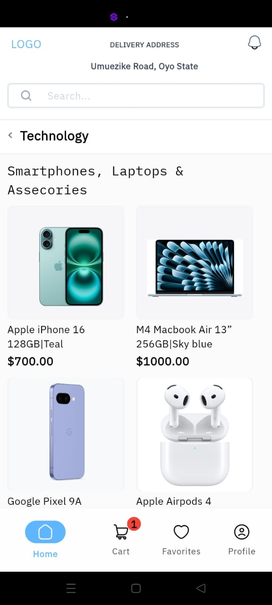

### Product Details & Cart Management
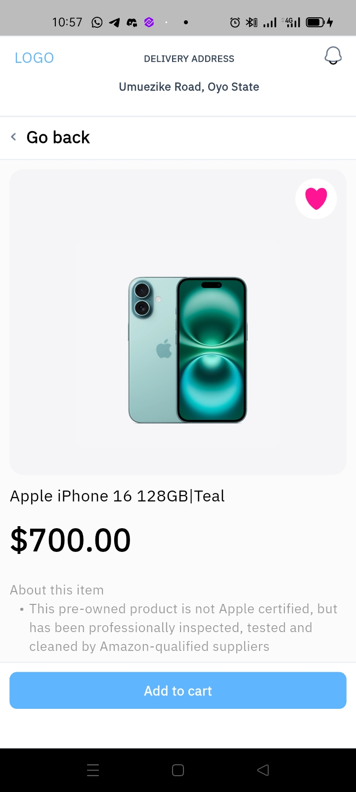
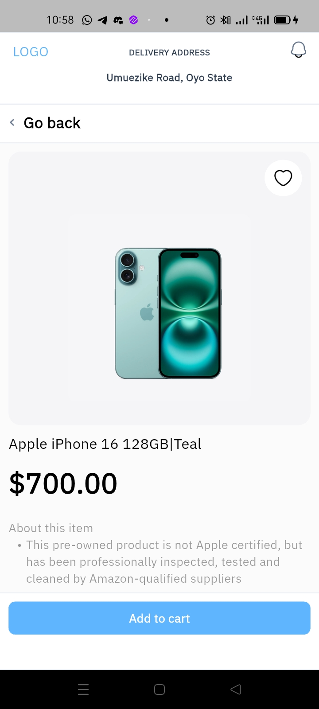
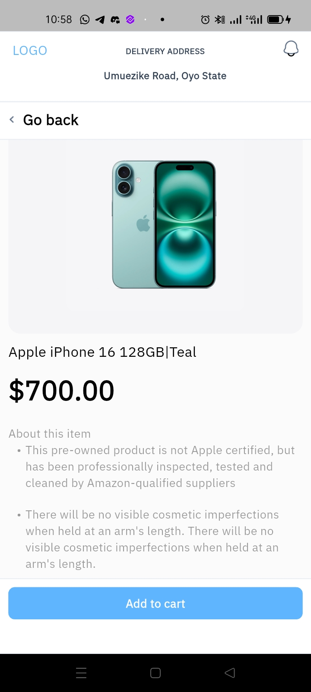
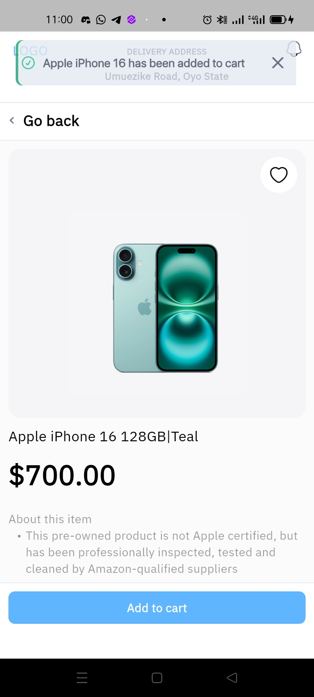

### Cart Operations & Checkout
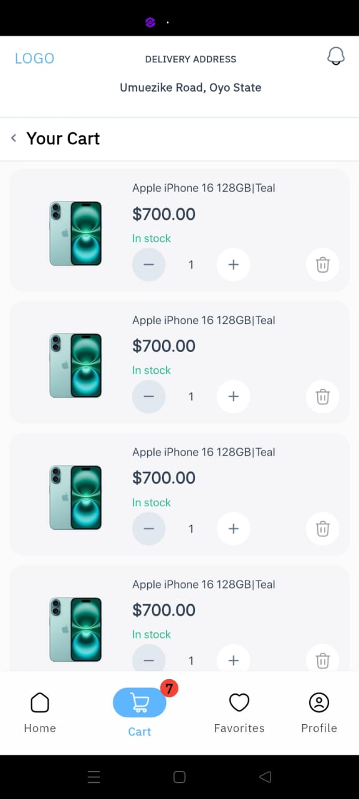

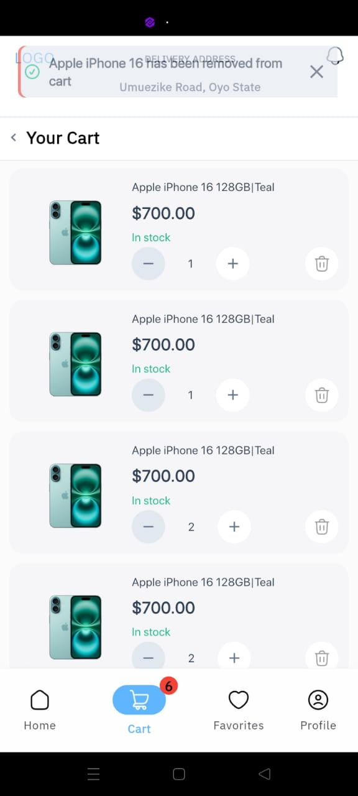
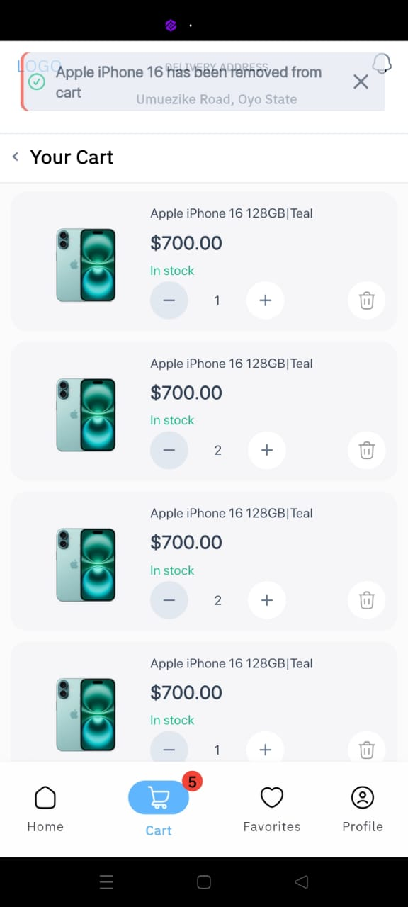
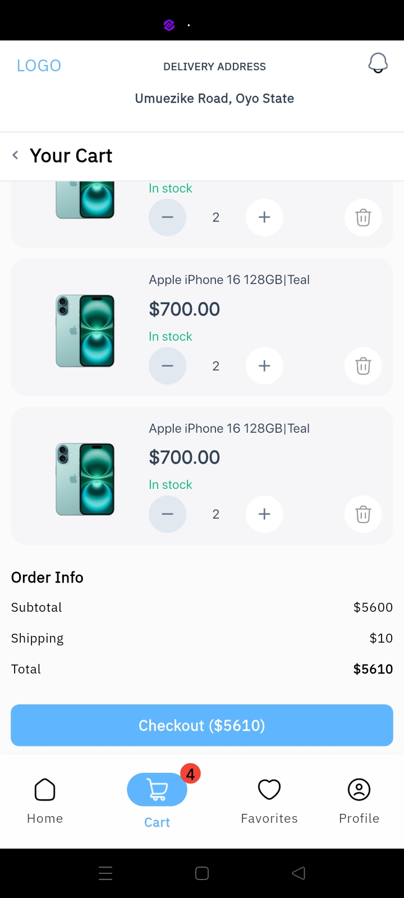
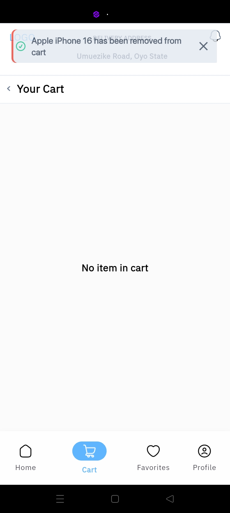
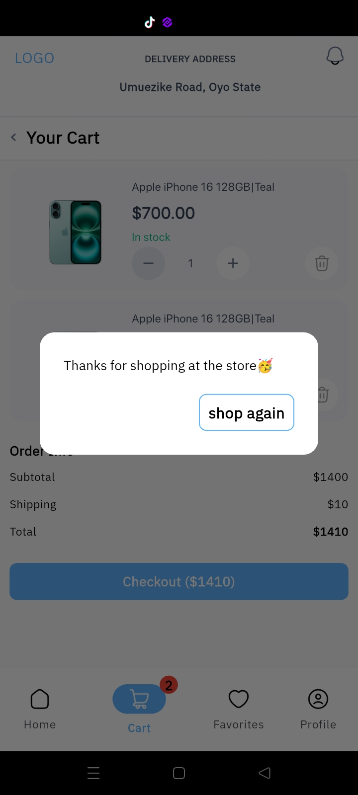

### Favorite Screen
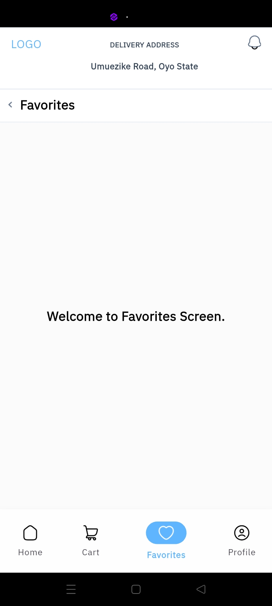

### Profile Screen
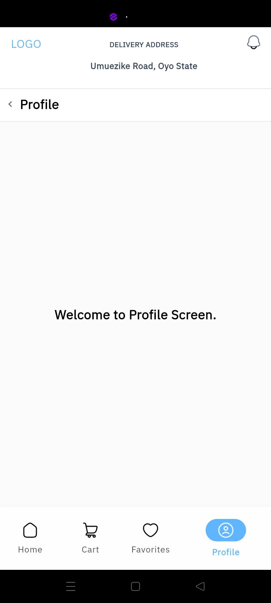

## 🛠️ Tech Stack

- **Framework**: Flutter
- **Language**: Dart
- **Architecture**: MVVM (Model-View-ViewModel)
- **State Management**: Riverpod
- **UI Components**: Custom Flutter widgets

## 🏗️ Project Structure

```
lib/
├── config/
│   ├── app_images.dart         # Image assets constants
│   ├── app_strings.dart        # String constants
│   └── app_colors.dart         # Color constants
├── model/
│   ├── button_state_model.dart # Button state management
│   └── accessory_model.dart    # Product/accessory data models
├── utils/
│   ├── smart_toast.dart        # Custom toast notifications
│   ├── alert.dart              # Checkout alert dialogs
│   └── enum.dart               # App enumerations
├── source/
│   └── [source files]         # Source files for each folder
├── view/
│   ├── screens/
│   │   ├── dashboard_screen.dart             # Main dashboard screen
│   │   ├── home_screen.dart                  # Home screen with products
│   │   ├── an_accessory_detail_screen.dart   # Product details screen
│   │   ├── cart_screen.dart                  # Shopping cart screen
│   │   ├── favorite_screen.dart              # Favorites screen
│   │   └── profile_screen.dart               # User profile screen
│   └── components/
│       └── [reusable widgets]  # Shared UI components
└── viewmodel/
    └── [screen logic files]    # Business logic for screens
```

## ✨ Features

### Core Functionality
- **Product Display**: Browse products on the home screen with images and pricing
- **Product Details**: View detailed information about each product
- **Add to Cart**: Seamless cart integration with visual feedback
- **Cart Management**: 
  - View all added items
  - Adjust quantities (up to 5 or more items per product)
  - Remove items with confirmation
  - Real-time total calculation with $10 shipping fee
- **Cart Badge**: Navigation bar shows item count
- **Checkout Process**: Complete purchase flow with confirmation modal
- **Favorites**: Save preferred items for later

### User Experience
- **Smart Notifications**: Toast alerts for cart actions
- **Responsive Design**: Clean, modern UI with smooth navigation
- **State Persistence**: Cart state maintained across screens
- **Interactive Elements**: Quantity controls, delete actions, and checkout flow

## 🚀 Setup & Installation

### Prerequisites
- Flutter SDK (latest stable version)
- Dart SDK
- Android Studio / VS Code
- iOS Simulator / Android Emulator

### Installation Steps

1. **Clone the repository**
   ```bash
   git clone https://github.com/obialohenry/delivery_app.git
   cd delivery_app
   ```

2. **Install dependencies**
   ```bash
   flutter pub get
   ```

3. **Run the application**
   ```bash
   # For Android
   flutter run

   # For iOS
   flutter run -d ios

  4. **Build for release**
   ```bash
   # Android APK
   flutter build apk --release

   # iOS
   flutter build ios --release
   ```

## 🎯 Usage

1. **Browse Products**: Launch the app to view available products on the home screen
2. **View Details**: Tap any product to see detailed information
3. **Add to Cart**: Use the "Add to cart" button to add items
4. **Manage Cart**: Navigate to cart screen to:
   - View all items
   - Adjust quantities using +/- buttons
   - Remove items using delete icon
   - See total cost including shipping
5. **Checkout**: Complete purchase with the checkout button
6. **Continue Shopping**: Use "Shop again" to reset and continue

## 🏛️ Architecture

The app follows **MVVM (Model-View-ViewModel)** architecture pattern:

- **Model**: Data structures and business objects
- **View**: UI components and screens
- **ViewModel**: Business logic and state management using Riverpod

This separation ensures:
- Clean code organization
- Testability
- Maintainability
- Scalability

## 📦 State Management

**Riverpod** is used for state management providing:
- Compile-time safety
- Provider composition
- Easy testing
- Better performance
- Automatic disposal

## 🎨 UI/UX Features

- Clean, modern design
- Consistent color scheme
- Responsive layout
- Smooth animations
- Intuitive navigation
- Visual feedback for user actions

## 📱 Platform Support

- ✅ Android
- ✅ iOS
- ✅ Web (with responsive design)

## 📞 Contact

Obialor Chisomebi Henry - obilaorchisomebi123@gmail.com

Project Link: [https://github.com/obialohenry/delivery_app](https://github.com/obialohenry/delivery_app)

---


